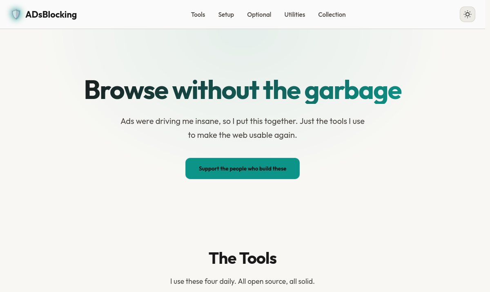

  

<h1 align="center">🛡️ ADsBlocking</h1>

  <strong>How to Block Ads</strong> 
  Ads were driving me insane, so I put this together. Just the tools I use every day.

  
  
  

---

## The Tools

I use these four daily. All open source, all solid.

### Firefox

Firefox is the only browser I'm willing to use. It's not perfect, but at least it doesn't fight you for blocking ads like Chromium-based browsers do.

[Download Firefox →](https://www.mozilla.org/firefox/)

### uBlock Origin

Best ad blocker out there. Fast, no tracking, kills the garbage. Just install it.

[Add to Firefox →](https://addons.mozilla.org/firefox/addon/ublock-origin/)

### Violentmonkey

Runs custom scripts on any site. I use it to skip link timers and clean up cluttered UI.

[Add to Firefox →](https://addons.mozilla.org/firefox/addon/violentmonkey/)

### Tampermonkey

Another scripts manager. Use it if you don't like Violentmonkey for some reason. Does the same thing.

[Add to Firefox →](https://addons.mozilla.org/en-US/firefox/addon/tampermonkey/)

### Link Bypasser

I hate "Wait 10 seconds" pages. This script skips them. Saves a lot of time.

[How to set it up →](https://codeberg.org/gongchandang49/bypass-all-shortlinks-debloated/)

---

## Step-by-Step

Do this in order. Setup takes only a few minutes.

### 01. Get Firefox

Firefox isn't perfect, but at least it won't lock you out for blocking ads like Chromium-based browsers do.

1. Download it: [mozilla.org/firefox](https://www.mozilla.org/firefox/)
2. Install it. Just click through.
3. Launch it.

> **Enable IP Protection (50 GB/mo):** Firefox has a built-in proxy that hides your IP from trackers.
> Free, 50 GB every month.
> Type `about:config` in the address bar → search for `browser.ipprotection.enabled` → toggle it to `true`.

### 02. Add uBlock Origin

The only extension you really need.

1. Install from [Add-ons Store](https://addons.mozilla.org/firefox/addon/ublock-origin/)
2. Hit "Add to Firefox"
3. It starts working immediately. Check your toolbar.

### 03. Script Manager

You need this to run custom scripts. Pick one:

- **Violentmonkey:** [I use this one (Recommended)](https://addons.mozilla.org/firefox/addon/violentmonkey/)
- **Tampermonkey:** [Use this if you want (Alternative)](https://addons.mozilla.org/en-US/firefox/addon/tampermonkey/)

### 04. Install the Bypasser

This kills the "Wait 10s" junk.

1. One-click install: [Install the Script](https://codeberg.org/gongchandang49/bypass-all-shortlinks-debloated/raw/branch/main/Bypass_All_Shortlinks.user.js)
2. Click "Confirm Installation" when the manager pops up.
3. Done. No more timers.

> **Note:** Check [gongchandang49's page](https://codeberg.org/gongchandang49/bypass-all-shortlinks-debloated/) sometimes for updates.

### 05. Filters & Sites

Mess with the settings once you know what you're doing.

- Add more filter lists in uBlock if you want.
- Whitelist sites that aren't trash.
- Find more scripts on [Greasyfork](https://greasyfork.org/).
- That's it. Enjoy.

---

## Other Stuff

Not required, but I use these to make things even cleaner.

### Privacy Badger

Sometimes redundant with uBlock. Still useful on sketchy sites.

[Add to Firefox →](https://addons.mozilla.org/en-US/firefox/addon/privacy-badger17/)

### Return YT Dislikes

I'm not wasting time on garbage tutorials. This brings back the dislikes so I know if a video is a waste of time.

[Add to Firefox →](https://addons.mozilla.org/en-US/firefox/addon/return-youtube-dislikes/)

### SponsorBlock

Skips the "sponsored by" garbage automatically. Saves hours of my life.

[Add to Firefox →](https://addons.mozilla.org/en-US/firefox/addon/sponsorblock/)

### DeArrow

I'm sick of seeing open-mouth thumbnails and red arrows. This replaces clickbait with community-sourced titles and actual frames from the video.

[Try it free →](https://dearrow.ajay.app/payment/#link=firefox)

---

## Utilities

Software you should probably have if you're on Windows.

### Windows Activation (MAS)

The only way to activate Windows and Office without the BS. Open source and clean.

[Visit massgrave.dev →](https://massgrave.dev/)

### Clean ISOs

Where to get official, untouched ISOs. No bloatware, no junk.

[Browse OS Downloads →](https://os.click/en)

### IDM Trial Reset

Resets the IDM trial. That's it. Simple utility by J2TEAM.

[Visit GitHub Repository →](https://github.com/J2TEAM/idm-trial-reset/releases/tag/v1.0.0)

### qBittorrent

A reliable, open-source alternative to uTorrent without ads or miners.

[Download qBittorrent →](https://www.qbittorrent.org/download)

### AB Download Manager

An IDM alternative that actually looks good. Fast as hell and open source.

[Download →](https://abdownloadmanager.com/#download) | [GitHub →](https://github.com/amir1376/ab-download-manager/releases/tag/v1.8.4)

### WinUtil (Chris Titus)

Use it to debloat Windows and install apps fast. I run this on every new install.

[View WinUtil on GitHub →](https://github.com/ChrisTitusTech/winutil)

### Morphe

Patches YouTube, YouTube Music, and Reddit. Adds ad blocking, SponsorBlock, and more.

[Visit morphe.software →](https://morphe.software/)

### ReVanced (APKs)

Pre-built ReVanced APKs if you don't want to patch them yourself.

[Visit GitHub Repository →](https://github.com/FiorenMas/Revanced-And-Revanced-Extended-Non-Root)

---

## The Collection

Where I go to find free resources.

### FMHY (Free Media Heck Yeah)

Massive collection of tools and stuff. If it's not here, it's not free.

[Explore FMHY →](https://fmhy.net/)

### Free for Devs

Huge list of services with free tiers. Check here before paying for anything.

[Browse Free Services →](https://free-for.dev/#/)

### Public APIs

List of free APIs. Good for testing stuff or building quick apps.

[Try Public APIs →](https://github.com/public-apis/public-apis)

### Piracy: Sail the High Seas

The subreddit for finding anything you don't want to pay for. Check the wiki.

[Visit Megathread →](https://old.reddit.com/r/Piracy/wiki/megathread)

---

## Support the creators

People spend their free time building these tools for us. If they save you time, throw them some money.

- [Support Raymond Hill (uBlock Origin)](https://github.com/gorhill/uBlock#readme)
- [Support Violentmonkey Team](https://github.com/violentmonkey/violentmonkey)
- [Support Tampermonkey Team](https://www.tampermonkey.net/)
- [Support gongchandang49 (Link Bypasser Scripts)](https://codeberg.org/gongchandang49/bypass-all-shortlinks-debloated/)
- [Support Mozilla Foundation](https://www.mozilla.org/foundation/)
- [Support EFF (Privacy Badger)](https://www.eff.org/pages/other-ways-give-and-donor-support)
- [Support Return YouTube Dislikes](https://returnyoutubedislike.com/donate)
- [Support Ajay Ramachandran (SponsorBlock)](https://sponsor.ajay.app/)
- [Support DeArrow](https://github.com/ajayyy/DeArrow)
- [Support Amir1376 (AB Download Manager)](https://github.com/amir1376/ab-download-manager/blob/master/DONATE.md)
- [Support massgravel (MAS)](https://massgrave.dev/)
- [Support J2TEAM (IDM Trial Reset)](https://github.com/J2TEAM/idm-trial-reset)
- [Support qBittorrent Community](https://www.qbittorrent.org/donate)
- [Support Chris Titus Tech (WinUtil)](https://github.com/sponsors/ChrisTitusTech)
- [Support Morphe](https://morphe.software/donate)
- [Support FiorenMas (ReVanced Non-Root)](https://github.com/FiorenMas/Revanced-And-Revanced-Extended-Non-Root)
- [free-for.dev](https://github.com/ripienaar/free-for-dev)
- [Public APIs](https://github.com/public-apis/public-apis)
- [Support r/Piracy](https://www.reddit.com/r/Piracy/)
- [Support DeArrow](https://github.com/ajayyy/DeArrow)

---

## Disclaimer

I don't host or mirror anything here. All links point to original sources, so if something breaks, changes, or disappears, that's on them not me. Always read what you're installing and understand what a script does before running it.

---

  Made with ♥ by <a href="https://github.com/E4crypt3d">E4CRYPT3D</a>

  © 2026 ADsBlocking Guide. All rights reserved.

